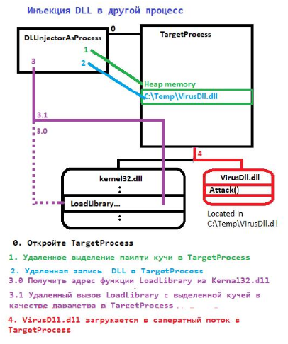

# lab3DLL
# Лабораторная работа №3

## DLL-инъекции и защита от DLL-инъекций в Windows

### Цель работы

Изучить механизм DLL-инъекции в процессы Windows и реализовать один из способов защиты от неё с использованием политики блокировки сторонних DLL.

---

## Структура проекта

```
Lab3DLL/
│
├── VirusDLL/
│   └── VirusDLL.cpp
│
├── TargetProcess/
│   └── TargetProcess.cpp
│
├── ProtectedTargetProcess/
│   └── ProtectedTargetProcess.cpp
│
├── DLLInjectorAsProcess/
│   └── DLLInjectorAsProcess.cpp
│
├── DllInjectorAsDll/
│   └── DllInjectorAsDll.cpp
│
├── DLLLoader/
│   └── DLLLoader.cpp
│
└── CMakeLists.txt
```

---

## Описание компонентов

### VirusDLL

Динамическая библиотека, выполняющая полезную нагрузку после загрузки в процесс.

При подключении DLL вызывается функция `Attack()`, которая отображает окно MessageBox с сообщением «BOOM!» и именем процесса, в который была загружена библиотека.

### TargetProcess

Тестовый процесс-жертва.

После запуска выводит собственный PID и выполняется в бесконечном цикле. PID используется инжектором для выбора целевого процесса.

### DLLLoader

Вспомогательная программа для проверки корректности сборки `VirusDLL.dll`.

Загружает библиотеку с помощью `LoadLibraryA()` в собственный процесс.

### DLLInjectorAsProcess

Инжектор DLL в виде консольного приложения.

Принимает PID процесса и выполняет следующие действия:

1. Открывает целевой процесс (`OpenProcess`).
2. Выделяет память в адресном пространстве процесса (`VirtualAllocEx`).
3. Записывает путь к DLL (`WriteProcessMemory`).
4. Получает адрес функции `LoadLibraryA`.
5. Создаёт удалённый поток (`CreateRemoteThread`).


### DllInjectorAsDll

Альтернативная реализация инжектора в виде DLL.

Экспортирует функцию `HelperFunc`, которая может быть вызвана через `Rundll32.exe`.

### ProtectedTargetProcess

Защищённая версия целевого процесса.

Для защиты используется механизм:

```cpp
PROCESS_CREATION_MITIGATION_POLICY_BLOCK_NON_MICROSOFT_BINARIES_ALWAYS_ON
```

Политика применяется через:

```cpp
UpdateProcThreadAttribute(...)
```

и запрещает загрузку неподписанных DLL в защищённый процесс.

После запуска процесс создаёт свою защищённую копию с политикой BLOCK_NON_MICROSOFT_BINARIES_ALWAYS_ON.

Дальнейшее выполнение происходит уже в защищённом дочернем процессе, который выводит свой PID и начинает рабочий цикл.
В зависимости от настроек запуска дочерний процесс может использовать ту же консоль, что и родительский процесс.

---

## Демонстрация работы

### Инъекция без защиты

1. Запустить `TargetProcess.exe`.
2. Получить PID процесса.
3. Выполнить:

```bash
DLLInjectorAsProcess.exe <PID>
```

Результат:

* DLL успешно загружается.
* Появляется окно с сообщением «BOOM!».

### Инъекция в защищённый процесс

1. Запустить `ProtectedTargetProcess.exe`.
2. Получить PID защищённого процесса.
3. Выполнить:

```bash
DLLInjectorAsProcess.exe <PID>
```

